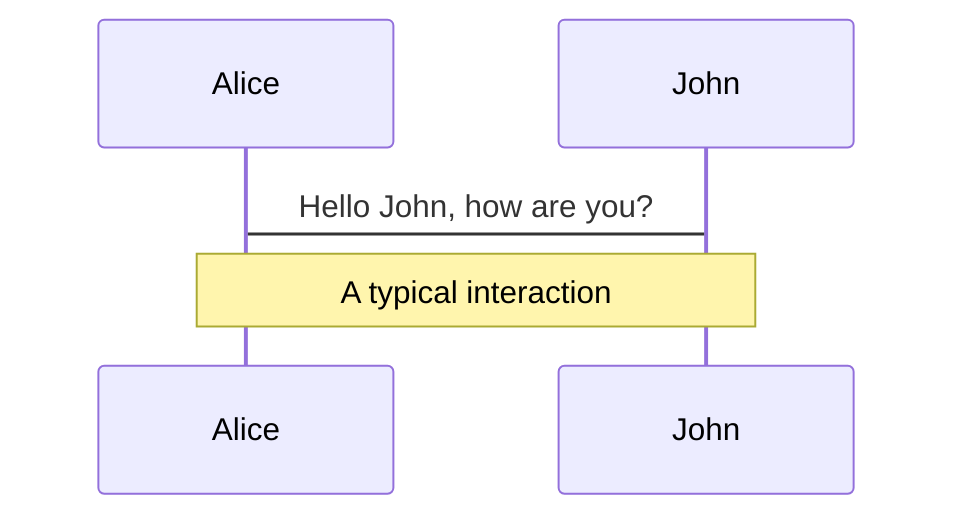
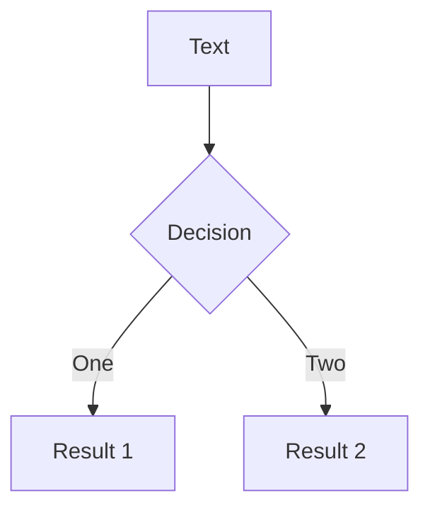

# sli.dev Presentation Demo

### October 20, 2021
##### Author Here

---

# What is Slidev?

Slidev is a slides maker and presenter designed for developers, consist of the following features

- 📝 **Text-based** - focus on the content with Markdown, and then style them later
- 🎨 **Themable** - theme can be shared and used with npm packages
- 🧑‍💻 **Developer Friendly** - code highlighting, live coding with autocompletion
- 🤹 **Interactive** - embedding Vue components to enhance your expressions
- 🎥 **Recording** - built-in recording and camera view
- 📤 **Portable** - export into PDF, PNGs, or even a hostable SPA
- 🛠 **Hackable** - anything possible on a webpage

<br>
<br>

Read more about [Why Slidev?](https://sli.dev/guide/why)

<!--
You can have `style` tag in markdown to override the style for the current page.
Learn more: https://sli.dev/guide/syntax#embedded-styles
-->

<style>
h1 {
  background-color: #2B90B6;
  background-image: linear-gradient(45deg, #4EC5D4 10%, #146b8c 20%);
  background-size: 100%;
  -webkit-background-clip: text;
  -moz-background-clip: text;
  -webkit-text-fill-color: transparent; 
  -moz-text-fill-color: transparent;
}
</style>

---
layout: 'fact'
---

# Placeholder

<v-clicks>

# Fill this out

### With something interesting

</v-clicks>

---
layout: 'fact'
---

> **Use this functionality with extreme care.**
> 
> &nbsp;
> 
> A native function is executed as a direct extension of the native code of the VM.
> 
> Execution is not made in a safe environment.
> 
> The VM **cannot** provide the same services as provided when executing Erlang code, such as pre-emptive scheduling or memory protection.
> 
> If the native function does not behave well, the whole VM will misbehave.
> 
> &nbsp;
> 
> &mdash; [Erlang: `erl_nif` Warning](https://erlang.org/doc/man/erl_nif.html)

---
layout: 'two-cols'
---

#### **Use this functionality with extreme care.**

<v-clicks>

- A native function that crashes will crash the whole VM.
- An erroneously implemented native function can cause a VM internal state inconsistency, which can cause a crash of the VM, or miscellaneous misbehaviors of the VM at any point after the call to the native function.
- A native function doing lengthy work before returning degrades responsiveness of the VM, and can cause miscellaneous strange behaviors. Such strange behaviors include, but are not limited to, extreme memory usage, and bad load balancing between schedulers. Strange behaviors that can occur because of lengthy work can also vary between Erlang/OTP releases.

</v-clicks>

::right::


---
layout: 'center'
---


<p class="text-center">
  <small>Some C/C++ developers, allegedly</small>
</p>

---

# Agenda

1. Diagrams and NIFs
2. Sidecar (Port)
3. Other Stuff

---
layout: 'fact'
---

## 1. Diagrams and NIFs

---
section: 1
---

# Diagrams

You can create diagrams / graphs from textual descriptions, directly in your Markdown.

<div class="grid grid-cols-2 gap-10 pt-4 -mb-6">





</div>

[Learn More](https://sli.dev/guide/syntax.html#diagrams)

---
section: 1
---

```c
int my_nif_load(ErlNifEnv *env, void **priv_data, ERL_NIF_TERM load_info) {
    return 0;
}

int my_nif_upgrade(ErlNifEnv *env, void **new_priv_data, void **old_priv_data, ERL_NIF_TERM load_info) {
    return 0;
}

void my_nif_unload(ErlNifEnv *env, void *priv_data) {
    return;
}

ERL_NIF_INIT(my_nif, my_nif_funcs, my_nif_load, NULL, my_nif_upgrade, my_nif_unload);
```

---
section: 1
---

```c {all|2-18|19-20|23-25|all}
ERL_NIF_TERM my_nif_hash_2(ErlNifEnv *env, int argc, const ERL_NIF_TERM argv[]) {
    unsigned long seed_ulong;
    ErlNifBinary key_bin;
    unsigned char *out_buf = NULL;
    ERL_NIF_TERM out_term;
    if (argc != 2) {
        return EXCP_NOTSUP(env, "argc must be 2");
    }
    if (!enif_get_ulong(env, argv[0], &seed_ulong) || seed_ulong > 0xFFFFFFFF) {
        return EXCP_BADARG(env, "Bad argument: 'Seed'");
    }
    if (!enif_inspect_iolist_as_binary(env, argv[1], &key_bin)) {
        return EXCP_BADARG(env, "Bad argument: 'Key'");
    }
    out_buf = enif_make_new_binary(env, 4, &out_term);
    if (out_buf == NULL) {
        return EXCP_ERROR(env, "Can't allocate 'Out' binary");
    }
    (void)MurmurHash3_x86_32(key_bin.data, key_bin.size, (uint32_t)seed_ulong, out_buf);
    return out_term;
}

ErlNifFunc my_nif_funcs[] = {
    {"hash", 2, my_nif_hash_2, ERL_NIF_NORMAL_JOB_BOUND},
};
```

---
section: 1
---

```erlang {all|3,17-19|13-15|all}
-module(my_nif).

-on_load(init/0).

%% NIF API
-export([hash/2]).

%% Types
-type seed() :: 0..16#FFFFFFFF.
-type out() :: <<_:32>>.
-export_type([seed/0, out/0]).

-spec hash(Seed, Key) -> Out when Seed :: seed(), Key :: iolist(), Out :: out().
hash(_Seed, _Key) ->
    erlang:nif_error({nif_not_loaded, ?MODULE}).

init() ->
    SoName = filename:join(code:priv_dir(?MODULE), ?MODULE_STRING),
    erlang:load_nif(SoName, 0).
```

---
layout: 'fact'
section: 1
---

# Why not FFI?

<v-clicks>

### Because Erlang is Special <br><br><br>

> There are some special cases, in which the languages compile into the same bytecode VM, like Clojure, Java, Elixir, and Erlang.
> 
> Since there is no interface, it is not an FFI, strictly speaking, while it offers the same functionality to the user.
> 
> &nbsp;
> 
> &mdash; [Thus saith Wikipedia: "Foreign Function Interface: Special Cases"](https://en.wikipedia.org/wiki/Foreign_function_interface#Special_cases)

</v-clicks>

---
layout: 'fact'
section: 1
---

# NIF != FFI

<v-clicks>

# NIF =/= FFI

</v-clicks>


---
layout: 'center'
section: 1
---


<p class="text-center">
  <small>Sweet, sweet lies.</small>
</p>

---
layout: 'fact'
section: 1
---

## How many reductions in 1 timeslice? <br><br>

<v-clicks>

### \~4,000 reductions / timeslice

</v-clicks>

---
layout: 'fact'
section: 1
---

## What the heck is a reduction? <br><br>

<v-clicks>

### ¯\\\_(ツ)\_/¯ <br><br>

> It is not completely defined what a reduction is, but at least each function call should be counted as a reduction.
> 
> Things get a bit more complicated when talking about BIFs and NIFs.
> 
> A process should not be able to run for "a long time" without using a reduction and yielding.
> 
> A function written in C can not yield in the middle, it has to make sure it is in a clean state and return.
> 
> &nbsp;
> 
> &mdash; [The BEAM Book: 11.3.2 "What is a Reduction Really?"](https://blog.stenmans.org/theBeamBook/#_what_is_a_reduction_really)

</v-clicks>

---
layout: 'fact'
---

## 2. Nativations and Code

---
section: 2
---

# Navigation

Hover on the bottom-left corner to see the navigation's controls panel, [learn more](https://sli.dev/guide/navigation.html)

### Keyboard Shortcuts

|     |     |
| --- | --- |
| <kbd>right</kbd> / <kbd>space</kbd>| next animation or slide |
| <kbd>left</kbd>  / <kbd>shift</kbd><kbd>space</kbd> | previous animation or slide |
| <kbd>up</kbd> | previous slide |
| <kbd>down</kbd> | next slide |

<!-- https://sli.dev/guide/animations.html#click-animations -->

<p v-after class="absolute bottom-23 left-45 opacity-30 transform -rotate-10">Here!</p>

---
layout: image-right
image: https://source.unsplash.com/collection/94734566/1920x1080
section: 2
---

# Code

Use code snippets and get the highlighting directly![^1]

```ts {all|2|1-6|9|all}
interface User {
  id: number
  firstName: string
  lastName: string
  role: string
}

function updateUser(id: number, update: User) {
  const user = getUser(id)
  const newUser = {...user, ...update}  
  saveUser(id, newUser)
}
```

<arrow v-click="3" x1="400" y1="420" x2="230" y2="330" color="#564" width="3" arrowSize="1" />

[^1]: [Learn More](https://sli.dev/guide/syntax.html#line-highlighting)

<style>
.footnotes-sep {
  @apply mt-20 opacity-10;
}
.footnotes {
  @apply text-sm opacity-75;
}
.footnote-backref {
  display: none;
}
</style>

---
section: 2
---

```c
int
main(int argc, char *argv[])
{
    ssize_t len;
    ssize_t wrote;
    ssize_t i;
    uint8_t buf[65536];

    do {
        len = read(STDIN_FILENO, buf, sizeof(buf));
        if (len > 0) {
            wrote = 0;
            do {
                if ((i = write(STDOUT_FILENO, buf + wrote, len - wrote)) <= 0) {
                    return 0;
                }
                wrote += i;
            } while (wrote < len);
        }
    } while (len > 0);

    return 0;
}
```

---
section: 2
---

```rust
static DEFAULT_UDS_FILENAME: &str = "/tmp/rust_port.sock";

#[tokio::main]
async fn main() -> tokio::io::Result<()> {
    let uds_filename = DEFAULT_UDS_FILENAME.to_owned();
    // UDS (Unix Domain Socket) echo
    tokio::fs::remove_file(&uds_filename).await.unwrap_or(());
    let uds_listener = tokio::net::UnixListener::bind(&uds_filename).unwrap();
    let _uds_task = tokio::task::spawn(async move {
        loop {
            let (uds_stream, _) = uds_listener.accept().await.unwrap();
            tokio::task::spawn(async move {
                let (mut uds_reader, mut uds_writer) = uds_stream.into_split();
                tokio::io::copy(&mut uds_reader, &mut uds_writer).await.unwrap();
            });
        }
    });
    tokio::fs::remove_file(&uds_filename).await.unwrap_or(());
    Ok(())
}
```

---
layout: 'fact'
---

## 3. Other Stuff

---
section: 3
---

# Components

<div grid="~ cols-2 gap-4">
<div>

You can use Vue components directly inside your slides.

We have provided a few built-in components like `<Tweet/>` and `<Youtube/>` that you can use directly. And adding your custom components is also super easy.

```html
<Counter :count="10" />
```

<!-- ./components/Counter.vue -->
<Counter :count="10" m="t-4" />

Check out [the guides](https://sli.dev/builtin/components.html) for more.

</div>
<div>

```html
<Tweet id="1390115482657726468" />
```

<Tweet id="1390115482657726468" scale="0.65" />

</div>
</div>


---
class: px-20
section: 3
---

# Themes

Slidev comes with powerful theming support. Themes can provide styles, layouts, components, or even configurations for tools. Switching between themes by just **one edit** in your frontmatter:

<div grid="~ cols-2 gap-2" m="-t-2">

```yaml
---
theme: default
---
```

```yaml
---
theme: seriph
---
```


</div>

Read more about [How to use a theme](https://sli.dev/themes/use.html) and
check out the [Awesome Themes Gallery](https://sli.dev/themes/gallery.html).

---
preload: false
section: 3
---

# Animations

Animations are powered by [@vueuse/motion](https://motion.vueuse.org/).

```html
<div
  v-motion
  :initial="{ x: -80 }"
  :enter="{ x: 0 }">
  Slidev
</div>
```

<div class="w-60 relative mt-6">
  <div class="relative w-40 h-40">
    
    
    
  </div>

  <div 
    class="text-5xl absolute top-14 left-40 text-[#2B90B6] -z-1"
    v-motion
    :initial="{ x: -80, opacity: 0}"
    :enter="{ x: 0, opacity: 1, transition: { delay: 2000, duration: 1000 } }">
    Slidev
  </div>
</div>

<!-- vue script setup scripts can be directly used in markdown, and will only affects current page -->
<script setup lang="ts">
const final = {
  x: 0,
  y: 0,
  rotate: 0,
  scale: 1,
  transition: {
    type: 'spring',
    damping: 10,
    stiffness: 20,
    mass: 2
  }
}
</script>

<div
  v-motion
  :initial="{ x:35, y: 40, opacity: 0}"
  :enter="{ y: 0, opacity: 1, transition: { delay: 3500 } }">

[Learn More](https://sli.dev/guide/animations.html#motion)

</div>

---
section: 3
---

# LaTeX

LaTeX is supported out-of-box powered by [KaTeX](https://katex.org/).

<br>

Inline $\sqrt{3x-1}+(1+x)^2$

Block
$$
\begin{array}{c}

\nabla \times \vec{\mathbf{B}} -\, \frac1c\, \frac{\partial\vec{\mathbf{E}}}{\partial t} &
= \frac{4\pi}{c}\vec{\mathbf{j}}    \nabla \cdot \vec{\mathbf{E}} & = 4 \pi \rho \\

\nabla \times \vec{\mathbf{E}}\, +\, \frac1c\, \frac{\partial\vec{\mathbf{B}}}{\partial t} & = \vec{\mathbf{0}} \\

\nabla \cdot \vec{\mathbf{B}} & = 0

\end{array}
$$

<br>

[Learn more](https://sli.dev/guide/syntax#latex)

---
section: 3
---

# Diagrams

You can create diagrams / graphs from textual descriptions, directly in your Markdown.

<div class="grid grid-cols-2 gap-10 pt-4 -mb-6">


</div>

[Learn More](https://sli.dev/guide/syntax.html#diagrams)


---
layout: center
class: text-center
section: 3
---

# Learn More

[Documentations](https://sli.dev) · [GitHub](https://github.com/slidevjs/slidev) · [Showcases](https://sli.dev/showcases.html)
